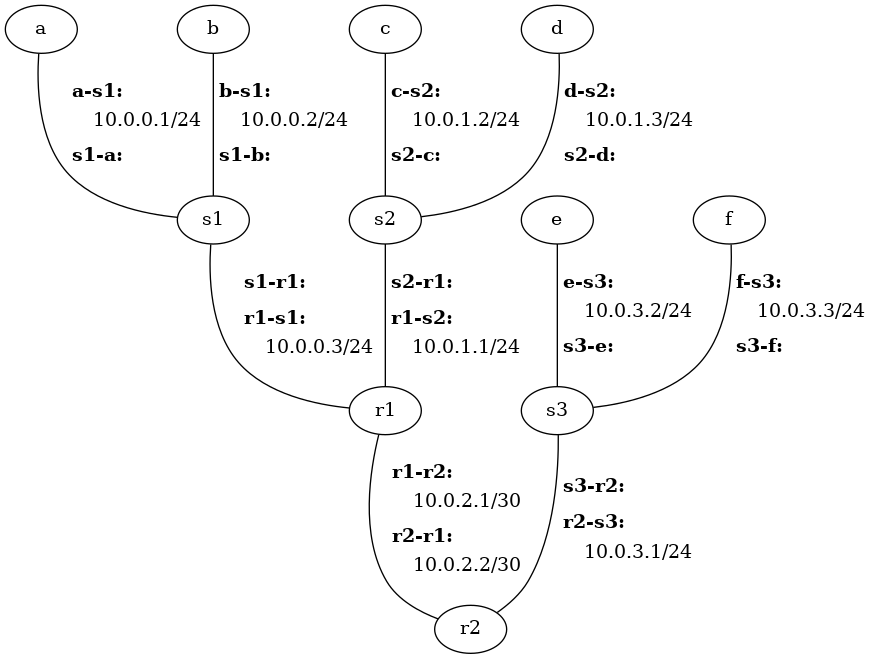

# Hands-On with the Network Layer

The objectives of this assignment are to 1) gain further experience with the
Cougarnet framework developed, and 2) gain hands-on experience with IP subnets
and IP forwarding.


# Getting Started

## Maintain Your Repository

 Before beginning:
 - [Mirror the class repository](../01b-hw-private-repo-mirror), if you haven't
   already.
 - [Merge upstream changes](../01b-hw-private-repo-mirror#update-your-mirrored-repository-from-the-upstream)
   into your private repository.

 As you complete the assignment:
 - [Commit changes to your private repository](../01b-hw-private-repo-mirror#commit-and-push-local-changes-to-your-private-repo).


# Part 1 - ARP and IP Forwarding

## Start the Network

File `h6-r2.cfg` contains a configuration file that describes a network with
six hosts: `a` and `b` connected to router `r1` through switch `s1`; `c` and
`d` connected to a different interface of router `r1` through switch `s2`; `e`
and `f` connected to `r2` through switch `s3`; and routers `r1` and `r2`
directly connected.  There are no VLANs in this scenario.

Run the following command to create and start the network:

```bash
cougarnet --display-file=net.png --wireshark=s1-a,s1-b,s1-r1,s2-c,s2-d,s2-r1,r1-r2 h6-r2.cfg
```

The `--display` option tells `cougarnet` to print out the network layout before
starting all the hosts, while `--display-file=net.png` creates an image,
`net.png`, showing the layout with more network details, including IP addresses
and interface names.  This image is included here for convenience:



With the `--wireshark` option, Wireshark will be launched and will begin
capturing packets on all interfaces associated with `s1` and `s2`.

Because of the current configuration, you will only see five terminals show up,
one associated with each of hosts `a`, `c`, and `e`, and one associated with
each of routers `r1` and `r2`.  You can change this with the `--terminal`
option.


## Exercises

Run the following commands on host `a` to show its network interface
configuration, IP forwarding table, and ARP table:

```bash
a$ ip addr 2> /dev/null
a$ ip route
a$ ip neigh
```

(The `2> /dev/null` simply redirects standard error, which is noisy due to
unknown causes related to working in a private network namespace :))

Note that while Cougarnet allows for MAC addresses to be explicitly configured
in the
[configuration file](https://github.com/cdeccio/cougarnet/blob/main/README.md#configuration-1),
in this scenario, the MAC addresses with which the interfaces are configured
are somewhat random.  The fact that they aren't explicitly configured is to
demonstrate how they are learned through ARP, without prior knowledge.  That
being said, you will want to take note of `a`'s MAC address for its `a-s1`
interface.  It is in the output of `ip addr 2> /dev/null`, following
`link/ether`.

You should only see one entry in the forwarding table:
```
10.0.0.0/24 dev a-s1 proto kernel scope link src 10.0.0.1
```

This entry means that for IP destinations matching `10.0.0.0/24`, the host will
send packets out interface (`dev`) `a-s1`, and that there is no explicit next
hop; that is, the next hop is whatever the IP destination is.  This table entry
is created automatically by the system when interface `a-s1` is enabled with IP
address `10.0.0.1/24` because it now knows that it is connected to the
`10.0.0.0/24` subnet and thus can reach all hosts in `10.0.0.1/24` without
going to a router first (i.e., the "next hop").

 1. Given the current contents of the IP forwarding table, what will happen
    when you attempt to send an IP datagram from `a` to `b` (10.0.0.2)?  You
    will test your guess later and can update your answer, if necessary.

 2. Given the current contents of the IP forwarding table, what will happen
    when you attempt to send an IP datagram from `a` to `c` (10.0.1.2)?  You
    will test your guess later and can update your answer, if necessary.

 3. Which entries are currently in `a`'s ARP table?

Now run the following command on `a` to send a single packet from `a` to `b`:

```bash
a$ ping -c 1 -W 1 10.0.0.2
```

Look at the Wireshark window, and sort by "Time".

 4. Consider the very first (in terms of time) frame sent from `a` (i.e., with
    the source MAC address that you noted in the output to `ip addr`).  What
    was the protocol and the purpose of the packet carried by the first frame
    sent by `a`?  (Hint: click on the frame, and look at the contents of the
    protocol just above the Ethernet frame in the "packet details" window.)

 5. Which of _all_ the hosts or routers connected to `s1` or `s2` observed
    this first frame from `a`?  Use the rows in the "packet list" window to
    answer the question.

 6. Why did _this_ set of hosts get the frame from `a` (no more, no less)?
    Hint: think about purpose of the packet, look at the addresses in the
    Ethernet frame header, and consider the makeup of the network.

 7. Which of _all_ the hosts or routers connected to `s1` or `s2` observed the
    response from from `b`?

 8. Why did _this_ set of hosts get the frame associated with `b`'s response
    (no more, no less)?

 9. Was the ping successful?  That is, did `a` get a response?  (Now would be a
    good time to revisit question 1 and ask yourself why or why not.)


Re-run the `ip neigh` command to see the new state of `a`'s ARP table:

```bash
a$ ip neigh
```

 10. Which entries are now in `a`'s ARP table?


Now run the following command on `a` to send a single packet from `a` to `c`:

```bash
a$ ping -c 1 -W 1 10.0.1.2
```

(The `-c` option tells `ping` to send just one packet, and the `-W` option
tells `ping` to only wait for one second for a response.)

 11. Was the ping successful?  That is, did `a` get a response?

 12. Which of _all_ the hosts or routers connected to `s1` or `s2` observed
     _any_ frame(s) associated with the `ping` command you just issued?

Let's now add an entry to `a`'s forwarding table.  The general formula is this:

```
$ sudo ip route add <prefix> via <next_hop> dev <int>
```

where `<prefix>` is an IP prefix (e.g., `192.0.2.0/24`), `<int>` is the name of
the interface on which outgoing packets should be sent for that prefix, and
`<next_hop>` is the IP address of the router on that local area network (LAN)
and subnet.

In this case, what we are looking to add is a "default" forwarding entry.  The
prefix for such an entry is `0.0.0.0/0`.  Because the prefix has a length of
zero, it matches _anything_.  However, because the more specific (i.e., longer)
prefix `10.0.0.0/24` is also in the table, and longest prefix match is used,
the default entry will only be selected if a datagram is destined for something
other than `10.0.0.0/24`.  Thus, only datagrams destined for addresses outside
`a`'s subnet will match the default forwarding entry.

The outgoing interface is the name of the interface out which datagrams
destined for the default forwarding entry should be sent.  Since `a` has only
one interface, there is no ambiguity; all datagrams should go out interface
`a-s1`.

The next-hop IP address for the default forwarding entry is the IP address of
the router to which datagrams destined for addresses that don't match any
more-specific entry should be sent.  In this case, the router is `r1`. (Not
`s1`!  Rememember that switches are link-layer (layer-2) devices and are
network-layer (layer-3) agnostic.)  However, `r1` has multiple interfaces and
an IP address for each!  Which one should be used for the next-hop IP address?
It must be the IP address for the interface that is on the same LAN---and thus
has an IP address in the same subnet---as the outgoing interface.  Since the
outgoing interface is `a-s1`, then `r1`'s corresponding interface is `r1-s1`
(not `r1-s2`, which is on a different LAN and has an IP address in a different
subnet).  So the next-hop IP address is 10.0.0.3.  Note that for end systems
like `a` and `b` (as opposed to routers, which have multiple interfaces), the
router's IP address, corresponding to the default forwarding entry, is known as
the *gateway*: it is the only way out for these hosts!

Use the `ip route` command with the values explained in the preceding
paragraphs to set run the default forwarding entry for host `a`.

Again run the following command on `a` to send a single packet from `a` to `c`:

```bash
a$ ping -c 1 -W 1 10.0.1.2
```

 13. Consider the very first (in terms of time) frame sent from `r1` on
     `r1-s2`. (To find the MAC address of `r1-s2`, run `ip addr 2> /dev/null`
     on `r1`).  What was the protocol and the purpose of the packet carried by
     the first frame sent by `r1`? (Hint: click on the frame, and look at the
     contents of the protocol just above the Ethernet frame in the "packet
     details" window.)

 14. Which of _all_ the hosts or routers connected to `s1` or `s2` observed
     this first frame from `r1`?  Use the rows in the "packet list" window to
     answer the question.

 15. Why did _this_ set of hosts get the frame from `r1` (no more, no less)?
     Hint: think about purpose of the packet, look at the addresses in the
     Ethernet frame header, and consider the makeup of the network.

 16. Was the ping successful?  That is, did `a` get a response?

Run the `ip neigh` command on `r1` to see the state of its ARP table:

 ```bash
 r1$ ip neigh
 ```

 17. Which entries are in `r1`'s ARP table?

 18. Why does `r1` have ARP entries for multiple subnets?

Add a default forwarding entry to host `c`.  Use the instructions above to add
a default forwarding entry.  You will need to adapt them for `c` instead of
`a`.  This default forwarding entry will enable `c` to send messages to hosts
outside its subnet, including the ping response to `a`.

Again run the following command on `a` to send a single packet from `a` to `c`:

```bash
a$ ping -c 1 -W 1 10.0.1.2
```

 19. Was the ping successful?  That is, did `a` get a response?  Hint: at this
     point, it should be.

Run the following command on `a` to send a single packet from `a` to `e`:

```bash
a$ ping -c 1 -W 1 10.0.3.2
```

 20. Was the ping successful?  That is, did `a` get a response?


You have created forwarding entries in `a` and `c` that direct them to send
datagrams destined for addresses outside their own subnets to `r1`.  However,
look at `r1`'s forwarding tables using the `ip route` command.  It only has
entries corresponding to the subnets in which it has interfaces.  It is the
same for `r2`.  That means that they have no matching entry for datagrams
destined for subnets other the ones to which they are directly connected.

What is needed then for `a` to send a datagram to `e`?  Router `r1` needs a
forwarding entry to direct datagrams destined for the `10.0.3.0/24` subnet to
`r2`.  Relatedly, what is needed for `e` to send a datagram to `a`?  Router
`r2` needs a forwarding entry to direct datagrams destined for the
`10.0.0.0/24` subnet to `r1`.

On `r1` and `r2` use the `ip route add` command to add the entries that will
allow `a` and `e` to communicate with one another, as described previously.  In
each case you will need to determine the appropriate IP prefixes, interface
names, and next-hop IP addresses. Finally, add a default forwarding entry for
host `e`, with `r2` as a gateway.  This one will be more similar to what you
did in the instructions preceding question 13.

Use the network diagram (i.e., `net.png`) as a reference to help you with this.
Think carefully about what you are wanting to do in each case.

Important Note: Use `ip route` (without further arguments) frequently to see if
the entries look correct.  If at any point add an incorrect entry into a table,
you don't  have to start over from scratch!  You can delete an existing entry
using `ip route del`.

Run the following command on `a` to send a single packet from `a` to `e`:

```bash
a$ ping -c 1 -W 1 10.0.3.2
```

 21. Was the ping successful?  That is, did `a` get a response?  Hint: it
     should be.

We will now make one last change to our network.  Add a default forwarding
entry for `r1` that has matching datagrams go towards `r2` (i.e., out interface
`r1-r2`).  Then add a default forwarding entry for `r2` that has matching
datagrams go towards `r1` (i.e., out interface `r2-r1`).  What will happen when
you send a datagram from `a` to destination `8.8.8.8`?  Answer the question to
yourself before testing it.  Then run the following to actually test it:

```bash
a$ ping -c 1 -W 1 8.8.8.8
```

 22. What happened with the ICMP echo request?


Stop `cougarnet` by entering `ctrl`-`c` at the terminal where it was launched.


# Part 2 - ICMP Error Messages and Fragmentation

## Start the Network

File `multi-hop-cfg` contains a configuration file that describes a network with
two hosts, `h1` and `h2`, separated by five routers, `r1` through `r5`.

Run the following command to create and start the network:

```bash
cougarnet --display-file=net2.png --disable-ipv6 --wireshark=h1-r1,h2-r5 multi-hop.cfg
```


A few notes about the config file and the network it describes:

 - `h1` and `h2` both have a default route installed, pointing to `r1` and
   `r5`, respectively.

 - Each router `r1` through `r4` has a default route pointing to the next
   highest router (e.g., `r1` to `r2`, `r2` to `r3`, etc.).

 - Each router `r2` through `r5` has a forwarding table entry for 10.0.0.0/24
   (the subnet shared by `h1` and `r1`) pointing the next lowest router (e.g.,
   `r5` to `r4`, etc.)

 - Other than the entries that correspond to the local subnets to which a host
   or router are connected, and those previously described, no other forwarding
   entries exist.

 - The maximum tranmission unit (MTU) for `h1` through `r3` is 1500, but the
   MTU for `r3` through `h2` is 500.

By default, all terminals will show up, but you can adjust this with the
`--terminal` option, if it is helpful to you.


## Exercises

Run the following to send an ICMP echo request/reply between `h1` and `h2`:

```
h1$ ping -c 1 -W 1 10.0.1.2
```

 23. What is the TTL reported by `ping`?

 24. Considering that Linux, by default, uses a starting TTL of 64 for IP
     packets that it creates, how many "hops" (i.e., routers) did the ICMP echo
     response pass through?

For each part of this problem, run the given command from `h1`, look at the
Wireshark capture, and then respond with 1) the host or router the sent the
ICMP error and 2) a *brief* description of why the ICMP error was sent.

 ```
 h1$ ping -c 1 -W 1 -t 3 10.0.1.2
 ```
 (`-t` sets the starting TTL)

 25. Which device sent the ICMP message?
 26. What was the cause of the ICMP message?

```
h1$ ping -c 1 -W 1 10.0.1.4
```
 27. Which device sent the ICMP message?
 28. What was the cause of the ICMP message?


```
h1$ ping -c 1 -W 1 10.0.3.1
```
 29. Which device sent the ICMP message?
 30. What was the cause of the ICMP message?

```
h1$ dig @10.0.1.2 +timeout=1 +tries=1 . NS
```
(`dig` is a command-line DNS tool.  For the purposes of this
assignment, just know that it is sending a single UDP datagram to
10.0.1.2 on port 53--and also, there is nothing listening on port 53
on `h2`. :))

 31. Which device sent the ICMP message?
 32. What was the cause of the ICMP message?

Run the following command from `h1`, which, sends an ICMP echo request of size
1500 to 10.0.1.2:

```
h1$ ping -c 1 -W 1 -s 1500 -M dont 10.0.1.2
```

Use wireshark to analyze the IP fragments resulting from the ICMP echo request.
Then answer the questions.

 33. How many total IP fragments result from the ICMP request?

 34. What are the sizes of each fragment, including the IP packet header?

 35. What are the offset values of each fragment, in eight-byte words?
