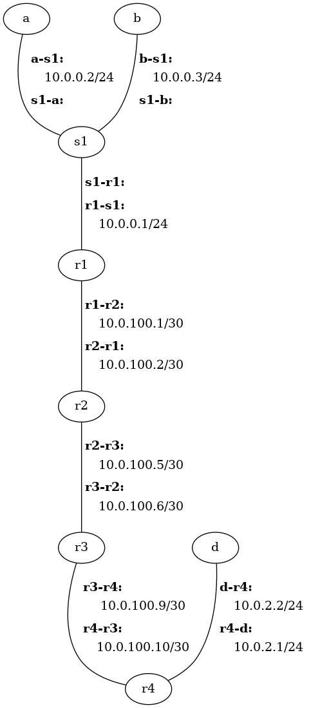

# Full-Stack Network Lab

This lab is the culmination of the labs you have accomplished up to this point.
With only few exceptions, you have implemented different components of the
network stack independent of the others.  In this lab you will glue those
components together to build a fully-functioning end-to-end communications path
and communicate over that path from socket to socket, process to process.

# Table of Contents

 - [Getting Started](#getting-started)
   - [Maintain Your Repository](#maintain-your-repository)
   - [Resources Provided](#resources-provided)
   - [Topology](#topology)
 - [Instructions](#instructions)
   - [Handle Subnet-Level Broadcasts](#handle-subnet-level-broadcasts)
   - [Integrate Forwarding Table](#integrate-forwarding-table)
   - [Integrate UDP Socket Functionality](#integrate-udp-socket-functionality)
   - [Integrate Routing with UDP Sockets](#integrate-routing-with-udp-sockets)
   - [Integrate TCP Socket Functionality](#integrate-tcp-socket-functionality)
   - [Integrate Layer-2 Switching](#integrate-layer-2-switching)
 - [Testing](#testing)
 - [Submission](#submission)


# Getting Started

## Maintain Your Repository

 Before beginning:
 - [Mirror the class repository](../01b-hw-private-repo-mirror), if you haven't
   already.
 - [Merge upstream changes](../01b-hw-private-repo-mirror#update-your-mirrored-repository-from-the-upstream)
   into your private repository.

 As you complete the assignment:
 - [Commit changes to your private repository](../01b-hw-private-repo-mirror#commit-and-push-local-changes-to-your-private-repo).


## Resources Provided

## Topology

All scenario files contain the same network topology.  Hosts `a` and `b` and
one interface of router `r1` are all connected via switch `s1`.  Routers `r1`,
`r2`, `r3`, and `r4` are directly connected to one another, in that order.
Finally host `d` is directly connected to router `r4`.



While the topology remains the same for all scenarios, there are some changes
across the different scenarios, including which hosts (if any) are running in
"native mode", what explicit routes (if any) are provided for manual entry into
forwarding tables, and what scripts (if any) are run.  Each is discussed in
more detail as it is used.

Please note that with `scenario1.cfg` through `scenario4.cfg`, all switches are
"native".  You will not apply your own switch implementation until very last.


# Instructions


## Handle Subnet-Level Broadcasts

 - Copy the `host.py` that you created in the
   [Network Layer Lab](../06-lab-network-layer) to the current directory,
   overwriting the stock file that was provided.
   
 - If you haven't already, follow the instructions in the section
   "[Handle IP Broadcasts](../06-lab-network-layer#handle-ip-subnet-level-broadcasts)"
   of the Network Layer Lab.

You can test your functionality after adding your forwarding table
implementation in the next step.


## Integrate Forwarding Table

Copy the `prefix.py` and `forwarding_table.py` files that you created in the
[Network Layer Lab](../06-lab-network-layer) to the current directory,
overwriting the stock files that were provided.

To test the functionality of subnet-level broadcasts with the help of your
forwarding table, you can run the following:

```bash
$ cougarnet --disable-ipv6 --terminal=a,b,r1 scenario1.cfg
```

At five seconds, a single ICMP packet is sent from host `a` to the broadcast IP
address for the subnet, i.e., 10.0.0.255.  You should see output that it is
received by all other hosts on the subnet/LAN, and you should _not_ see the text
output "ICMP packet not for me.", which means that it has been treated as a
packet to be ignored or forwarded.

To test the functionality of your forwarding table more generally, you can run
the following:

```bash
$ cougarnet --disable-ipv6 scenario2.cfg
```

With this configuration, routers `r1` through `r4` run your implementation for
forwarding table lookups and forwarding, but they get their entries from the
configuration file (`scenario2.cfg`), not from routing.  After 4 seconds, host
`a` will send an ICMP echo request to `d`, and after 5 seconds, host `d` will,
in turn, send an ICMP echo request (not response) to `a`.  The main console
should show that each of these was received by the destination.


## Integrate UDP Socket Functionality

 - Copy the `transporthost.py` file containing the working implementation of
   the `TransportHost` class that you created in the
   [Transport Layer Lab](../09-lab-transport-layer).
   to `transporthost.py`.
 - Copy the `headers.py` file containing the working implementation of the
   `IPv4Header`, `UDPHeader`, and `TCPHeader` classes that you created in
   [Transport Layer Lab](../09-lab-transport-layer) to `headers.py`.
 - Integrate your implementation of the `UDPSocket` into `mysocket.py`, using
   the `mysocket.py` you created in the
   [Transport Layer Lab](../09-lab-transport-layer).
   Integration of your `TCPSocket` implementation will come at a later step.


## Integrate Routing with UDP Sockets

 - Integrate your distance vector (DV) routing implementation from the
   `DVRouter` class into `dvrouter.py`, using the `dvrouter.py` you created in
   the [Routing Lab](../08-lab-routing).  Specifically:

   - Copy over the `handle_dv_message()`, `update_dv()`,
     `send_dv()`, and `handle_down_link()` methods that you
     created.
   - Copy over any helper methods that you might have created.
   - Integrate any custom initialization into the `__init__()` method.

   It is important that you integrate your code in the newer file, rather than
   simply overwriting the existing file; the existing file has been updated for
   use with this lab.  Specifically:
   - The `DVRouter` class now inherits from the `TransportHost` class, and it
     uses instances of `UDPSocket` to send and receive DV message with other
     routers (e.g., in the `_handle_msg()` and `_send_msg()` methods).  Note
     that this does not affect the way you called the helper method that you
     used previously, `_send_msg()`; its arguments are the same.
   - The file `dvrouter.py` contains a `main()` function, such that a host
     running it functions like a router that forwards packets, and uses DV to
     learn routes and update forwarding tables.

To test routing using your own forwarding table, you can run the following:

```bash
$ cougarnet --disable-ipv6 scenario3.cfg
```

With this configuration, routers `r1` through `r4` run your implementation for
forwarding table lookups and forwarding, and their forwarding entries are
created from DV routing.  Also, the routers are passing UDP packets using
sockets that you have implemented.  After 10 seconds (allowing some time for
the routes to propagate), host `a` will send an ICMP echo request to `d`, and
after 11 seconds, host `d` will, in turn, send an ICMP echo request (not
response) to `a`.  The main console should show that each of these was received
by the destination.


## Integrate TCP Socket Functionality

 - Copy the `buffer.py` file containing the working implementation of the
   `TCPSendBuffer` and `TCPReceiveBuffer` classes that you created in the
   [TCP Lab](../11-lab-tcp-reliable-transport).
   to `buffer.py`.
 - Integrate your TCP implementation from the `TCPSocket` class into
   the `mysocket.py` file, using the `mysocket.py` you created in the
   [Transport Layer Lab](../09-lab-transport-layer).
   _and_ the `mysocket.py` you created in the
   [TCP Lab](../11-lab-tcp-reliable-transport).
   The former will have the methods for the TCP three-way handshake, and the
   latter will have the methods for reliable transport.

   It is important that you integrate your code in the newer file, rather than
   simply overwriting the existing file; the existing file has been updated for
   use with this lab.  In particular, the initialization methods include
   additional arguments for a more full-featured and flexible TCP
   implementation.
 - In the [Transport Layer Lab](../09-lab-transport-layer) you implemented TCP's
   three-way handshake by fleshing out (among others) the
   `TCPSocket.handle_syn()` and `TCPSocket.handle_synack()` methods.  In those
   methods the initial sequence number of the client and that of the server are
   learned, respectively, by the server and the client.  However, in that lab,
   no data was exchanged, so there was no need to initialize a receive buffer.

   In the [TCP Lab](../11-lab-tcp-reliable-transport) data was reliably exchanged,
   but instead of using a three-way handshake to exchange initial sequence
   numbers, they were manually set using the `TCPSocket.bypass_handshake()`
   method.

   In this lab, you will use the TCP three-way handshake to exchange the
   initial sequence numbers that will be used to reliably transmit data.  That
   means that you will need to modify the methods associated with the three-way
   handshake to initialize the receive buffer, once the initial sequence number
   of the remote peer has been learned.

   Modify `TCPSocket.handle_syn()` and `TCPSocket.handle_synack()` such that
   the `receive_buffer` is initialized in each case using the initial sequence
   number sent in the SYN or SYNACK packet, respectively.  You should also make
   sure that the `seq` and `ack` instance variables are set appropriately when
   the three-way handshake is complete.

   Essentially, all the things that were done by `TCPSocket.bypass_handshake()`
   should now be done as part of the three-way handshake.

To test TCP connectivity between hosts separated by multiple routers, you can
run the following:

```bash
$ cougarnet --disable-ipv6 scenario4.cfg
```

The scripts associated with this configuration do the following:

 - Routers `r1` through `r4` begin running DV algorithm immediately.
 - Hosts alow some time to pass, so the routes can propagate amongst routers
   `r1` through `r4`.
 - At 10 seconds, host `d` instantiates an `EchoServerTCP` instance (see
   `echoserver.py`), which uses a `TCPListenerSocket` instance to listen for
   incoming connection requests.  The app simply listens for incoming clients
   over TCP, and returns any messages they send over the same TCP connection.
 - At 12 seconds, host `a` instantiates a `NetcatTCP` instance (see `nc.py`),
   which is netcat-like app.  The app simply opens a TCP connection to a
   server, sends messages using its `send()` method, and prints to standard
   output any messages that it receives from its TCP peer.
 - At 13 seconds, host `a` uses its `NetcatTCP` instance to send a message to
   the `EchoServerTCP`.  Host `a` should receive the response and print it out
   to standard output.  A log of this interaction should show up on the console.
   Also, because of ARP and switching, the only hosts that should be seeing
   packets associated with the TCP connection are `a` and `d`.
 - At 14 and 15 seconds, host `b` launches its own `NetcatTCP` instance and
   sends a message, respectively.  The log should show that the only hosts
   seeing packets associated with this connection are `b` and `d`.
 - At 16 and 17 seconds, hosts `a` and `b`, respectively, send additional
   messages to the `EchoServerTCP` instance at host `d`, which returns their
   communications.  Indeed your host is mulitplexing TCP connections!


## Integrate Layer-2 Switching

 - Copy the `switch.py` file containing the working implementation of the `Switch`
   class that you created in the
   [Link Layer Lab](../04-lab-link-layer).
   to `switch.py`.


With your own switch in place, you are now ready to test the functionality of
the network stack that you created, piece by piece.  Run the following:

```bash
$ cougarnet --disable-ipv6 scenario5.cfg
```

The behavior associated with `scenario5.cfg` is exactly the same as that of
`scenario4.cfg`, with one exception: `scenario5.cfg` uses your switch
implementation.  Thus, it should behave in exactly the same way.


# Testing

`scenario5.cfg` is the one that will ultimately be used to test your full-stack
network implementation.  Make sure it works with the `--terminal=none` option:

```bash
$ cougarnet --disable-ipv6 --terminal=none scenario5.cfg
```

If you would like to test against a configuration that has all but the routing
component, you can use the following:

```bash
$ cougarnet --disable-ipv6 --terminal=none scenario5-norouting.cfg
```

You can submit that code that works against `scenario5-norouting.cfg` for
lesser credit.


# Submission

Use the following commands to create a directory, place your working files in
it, and tar it up:

```
$ mkdir full-stack-lab
$ cp buffer.py dvrouter.py forwarding_table.py headers.py host.py mysocket.py prefix.py switch.py transporthost.py full-stack-lab
$ tar -zcvf full-stack-lab.tar.gz full-stack-lab
```
